# Banking AI Customer Support Workflows

## 🔄 Core Banking Workflows

### 1. Transaction Dispute Resolution
```mermaid
graph TB
    A[Customer: "I didn't make this ₹5000 payment"] --> B{AI Analysis}
    B --> C[Check Account History API]
    B --> D[Check Transaction Details API]
    B --> E[Check Device/Location Data API]
    
    C --> F{Transaction Found?}
    D --> G{Suspicious Pattern?}
    E --> H{Known Device/Location?}
    
    F -->|Yes| I[Validate Transaction Details]
    F -->|No| J[Escalate to Fraud Team]
    
    G -->|Yes| K[Auto-block Card + Fraud Alert]
    G -->|No| L[Request Additional Info]
    
    H -->|No| M[Security Questions + OTP]
    H -->|Yes| N[Standard Dispute Process]
    
    I --> O[Generate Dispute Reference]
    O --> P[Update CRM + Send SMS/Email]
```

### 2. Account Access Issues
```mermaid
graph TB
    A[Customer: "Can't login to mobile app"] --> B{AI Diagnosis}
    B --> C[Check Account Status API]
    B --> D[Check Last Login Attempts]
    B --> E[Check App Version/Device Info]
    
    C --> F{Account Active?}
    F -->|No| G[Check Block Reason API]
    F -->|Yes| H[Troubleshoot Login Steps]
    
    G --> I{Auto-Resolvable?}
    I -->|Yes| J[Auto-unblock + Send OTP]
    I -->|No| K[Escalate to Account Team]
    
    H --> L[Guide Through Password Reset]
    L --> M[Send Secure Reset Link]
    M --> N[Monitor Reset Completion]
```

### 3. Balance & Statement Inquiries
```mermaid
graph TB
    A[Customer: "What's my account balance?"] --> B[Authenticate Customer]
    B --> C{Authentication Success?}
    C -->|Yes| D[Fetch Real-time Balance API]
    C -->|No| E[Security Challenge]
    
    D --> F[Check for Holds/Freezes]
    F --> G[Format Balance Response]
    G --> H[Provide Available vs Total]
    H --> I[Offer Related Services]
    
    E --> J{Challenge Passed?}
    J -->|Yes| D
    J -->|No| K[Security Escalation]
```

## 💳 Banking-Specific API Integrations Required

### Core Banking APIs
- **Account Management**: Balance, status, holds, limits
- **Transaction APIs**: History, pending, disputes, categories
- **Card Services**: Block/unblock, PIN change, limits
- **Customer Profile**: KYC status, contact info, preferences
- **Fraud Detection**: Risk scores, suspicious patterns
- **Loan Services**: EMI schedules, outstanding amounts
- **Investment Services**: Portfolio, SIP status, NAV updates

### External Integrations
- **Credit Bureau**: CIBIL score checks
- **Payment Gateways**: UPI, NEFT, IMPS status
- **Regulatory**: RBI compliance, transaction limits
- **Communication**: SMS, Email, Push notifications
- **Identity**: Aadhaar verification, OTP services

## 🎯 AI Agent Personalities for Banking

### 1. General Support Agent
```
PERSONALITY: Friendly, professional, empathetic
TONE: Conversational but respectful
ESCALATION: Conservative (escalate complex issues)
SPECIALIZATION: Account queries, basic troubleshooting
```

### 2. Fraud Prevention Agent  
```
PERSONALITY: Serious, security-focused, thorough
TONE: Direct and reassuring
ESCALATION: Immediate for suspected fraud
SPECIALIZATION: Suspicious transactions, account security
```

### 3. Investment Advisory Agent
```
PERSONALITY: Knowledgeable, patient, educational
TONE: Advisory but not pushy
ESCALATION: Licensed advisor for specific recommendations  
SPECIALIZATION: Portfolio queries, SIP management, market updates
```

## 📊 Banking Support Metrics & KPIs

### Customer Experience Metrics
- **First Contact Resolution**: 70%+ target
- **Average Response Time**: <30 seconds
- **Customer Satisfaction**: 4.5/5 stars
- **Escalation Rate**: <15% of conversations

### Operational Metrics  
- **API Response Times**: Core banking <2s
- **Authentication Success**: >95%
- **Fraud Detection Accuracy**: >99%
- **Compliance Score**: 100% regulatory adherence

### Business Impact Metrics
- **Cost per Resolution**: 70% reduction vs human agents
- **24/7 Availability**: 99.9% uptime
- **Language Support**: Hindi, English, regional languages
- **Channel Coverage**: Web, mobile, WhatsApp, voice

## 🚀 Advanced Banking AI Features

### Proactive Support
- **Transaction Alerts**: "Your salary was credited, would you like to set up an SIP?"
- **Bill Reminders**: "Your credit card payment is due tomorrow"
- **Fraud Warnings**: "Unusual login attempt detected from new device"
- **Product Recommendations**: Based on spending patterns and life events

### Contextual Intelligence
- **Customer Journey**: Track across all touchpoints (branch, ATM, mobile, web)
- **Life Event Detection**: Job changes, marriages, home purchases
- **Spending Analytics**: Categorize and provide insights
- **Risk Assessment**: Real-time credit and fraud scoring

### Compliance & Security
- **Automated Compliance**: Built-in RBI guidelines and limits
- **Audit Trails**: Complete conversation logging for regulatory review
- **Data Privacy**: PII masking and secure data handling
- **Multi-factor Auth**: OTP, biometrics, device recognition


# AI-Native Enterprise Management Platform

## 🏗️ Platform Architecture Overview

```mermaid
graph TB
    subgraph "Enterprise Admin Console"
        A[Company Dashboard]
        B[API Integration Hub]
        C[AI Workflow Builder]
        D[Knowledge Management]
        E[Team & Permissions]
        F[Analytics & Reports]
    end
    
    subgraph "Agent Command Center"
        G[Live Chat Monitor]
        H[Customer 360 View]
        I[Escalation Queue]
        J[Lead Pipeline]
        K[Performance Metrics]
        L[Training Center]
    end
    
    subgraph "Customer Channels"
        M[Web Chat Widget]
        N[Mobile SDK]
        O[WhatsApp API]
        P[Voice/Phone]
        Q[Email Integration]
        R[Social Media]
    end
    
    subgraph "Core AI Engine"
        S[LangGraph Orchestrator]
        T[Multi-Model LLM Router]
        U[Vector Knowledge Base]
        V[Real-time APIs]
        W[Context Memory]
    end
    
    A --> S
    B --> V
    C --> S
    D --> U
    G --> S
    M --> S
    N --> S
    O --> S
```



## 🎛️ Enterprise Admin Console Features

### 1. Company Dashboard
```javascript
// Key Metrics Display
{
  "daily_stats": {
    "total_conversations": 1247,
    "ai_resolution_rate": 73.2,
    "avg_response_time": "8.3s",
    "customer_satisfaction": 4.6,
    "cost_per_resolution": "₹12.50"
  },
  "trending_issues": [
    "UPI transaction failures - 23% increase",
    "Mobile app login issues - 15% increase", 
    "Credit card payment queries - 8% increase"
  ],
  "ai_performance": {
    "confidence_score": 94.2,
    "accuracy_rate": 91.8,
    "learning_rate": "+2.3% this week"
  }
}
```

### 2. API Integration Hub
- **Visual API Connector**: Drag-and-drop API integration
- **Authentication Manager**: OAuth, API keys, certificates
- **Data Mapping**: Map banking APIs to AI workflows
- **Rate Limit Management**: Handle API quotas and throttling
- **Error Handling**: Retry logic and fallback strategies
- **Testing Suite**: API endpoint testing and validation

### 3. AI Workflow Builder (Visual LangGraph)
```python
# Visual Workflow Example: Transaction Dispute
workflow_definition = {
    "name": "Transaction Dispute Resolution",
    "trigger": "customer mentions 'wrong charge' or 'didn't make payment'",
    "steps": [
        {
            "id": "authenticate",
            "type": "security_check",
            "params": {"method": "otp", "fallback": "security_questions"}
        },
        {
            "id": "fetch_transaction", 
            "type": "api_call",
            "api": "core_banking.get_transactions",
            "params": {"days": 30, "amount_range": "user_mentioned"}
        },
        {
            "id": "analyze_pattern",
            "type": "ai_analysis", 
            "prompt": "Analyze transaction for fraud indicators",
            "escalation_threshold": 0.7
        },
        {
            "id": "resolution",
            "type": "conditional",
            "conditions": {
                "fraud_score > 0.8": "escalate_to_fraud_team",
                "customer_error": "educate_and_close",
                "system_error": "process_refund"
            }
        }
    ]
}
```

### 4. Knowledge Management System
- **Document Processing**: AI-powered PDF, Word, web scraping
- **Auto-categorization**: Smart tagging and organization
- **Version Control**: Track policy changes and updates
- **Approval Workflows**: Multi-level content approval
- **Performance Tracking**: Which knowledge helps most
- **Smart Recommendations**: Suggest missing documentation

## 📱 Agent Command Center ("Instagram-like" Interface)

### Real-time Chat Feed
```javascript
// Live Chat Interface Structure
{
  "active_conversations": [
    {
      "customer_id": "CUST_789123",
      "customer_name": "Rajesh Kumar",
      "channel": "WhatsApp",
      "ai_confidence": 0.94,
      "issue_category": "Transaction Dispute", 
      "conversation_start": "2024-01-15T10:30:00Z",
      "current_step": "Authenticating customer",
      "risk_level": "medium",
      "agent_intervention_needed": false,
      "messages": [...]
    }
  ],
  "escalation_queue": [
    {
      "priority": "high",
      "reason": "Fraud suspected - ₹50,000 transaction",
      "waiting_time": "2m 34s",
      "customer_tier": "Premium"
    }
  ]
}
```

### Customer 360° View
- **Account Overview**: Balances, products, relationship value
- **Interaction History**: All touchpoints (branch, ATM, digital)
- **AI Insights**: Spending patterns, life events, needs prediction
- **Risk Profile**: Credit score, fraud indicators, behavior analysis
- **Communication Preferences**: Channel preferences, language, timing
- **Satisfaction Scores**: Historical CSAT, NPS trends

### Lead Pipeline Management
- **Intent Detection**: "Looking to invest", "Need a loan"
- **Lead Scoring**: AI-powered qualification
- **Product Recommendations**: Based on profile and behavior
- **Follow-up Automation**: Nurture sequences
- **Conversion Tracking**: Support to sales pipeline

## 🛠️ Technical Implementation Stack

### Backend Services
```yaml
# Microservices Architecture
services:
  enterprise_api:
    description: "Main enterprise management API"
    tech: "FastAPI + PostgreSQL"
    features: ["Multi-tenancy", "RBAC", "Audit logging"]
  
  ai_orchestrator:
    description: "LangGraph workflow engine"
    tech: "Python + Redis + Celery"
    features: ["Dynamic routing", "Context memory", "Fallbacks"]
  
  integration_hub:
    description: "External API management" 
    tech: "Kong API Gateway + Docker"
    features: ["Rate limiting", "Auth proxy", "Monitoring"]
  
  analytics_engine:
    description: "Real-time analytics and reporting"
    tech: "ClickHouse + Grafana"
    features: ["Real-time dashboards", "Custom reports", "Alerts"]
```

### Frontend Applications
```yaml
admin_console:
  description: "Enterprise management interface"
  tech: "React + TypeScript + TailwindCSS"
  features: ["Responsive design", "Real-time updates", "Role-based UI"]

agent_dashboard:
  description: "Agent command center"
  tech: "React + Socket.IO + Charts.js"
  features: ["Real-time chat", "Live metrics", "Mobile responsive"]

customer_widgets:
  description: "Embeddable customer interfaces"
  tech: "Vanilla JS + Web Components"
  features: ["Multi-channel", "Customizable", "Lightweight"]
```

## 🔐 Enterprise Security & Compliance

### Banking Compliance Features
- **RBI Compliance**: Built-in regulatory rules and limits
- **Data Residency**: India-only data storage options
- **Audit Trails**: Complete conversation and action logging
- **PII Protection**: Automatic masking and encryption
- **Role-based Access**: Granular permissions system
- **SOC 2 Type II**: Security audit compliance
- **ISO 27001**: Information security standards

### Security Architecture
```yaml
security_layers:
  authentication:
    - "Multi-factor authentication (MFA)"
    - "SSO integration (SAML, OAuth)"
    - "API key management"
  
  authorization:
    - "Role-based access control (RBAC)"
    - "Resource-level permissions"
    - "Time-based access controls"
  
  data_protection:
    - "End-to-end encryption"
    - "PII tokenization"
    - "Secure key management"
    - "Data masking in logs"
  
  monitoring:
    - "Real-time threat detection"
    - "Anomaly detection"
    - "Security incident response"
    - "Compliance reporting"
```

## 📈 Pricing & Deployment Models

### Pricing Tiers
```yaml
starter:
  price: "₹25,000/month"
  features: ["Up to 1000 conversations/month", "Basic integrations", "Standard support"]

professional:
  price: "₹75,000/month"  
  features: ["Up to 10,000 conversations/month", "Advanced workflows", "Premium support", "Custom integrations"]

enterprise:
  price: "Custom pricing"
  features: ["Unlimited conversations", "On-premise deployment", "Dedicated support", "White-labeling"]
```

### Deployment Options
- **SaaS (Multi-tenant)**: Fastest deployment, shared infrastructure
- **Private Cloud**: Dedicated infrastructure, enhanced security
- **On-premise**: Complete control, regulatory compliance
- **Hybrid**: Mix of cloud and on-premise components

## 🚀 Go-to-Market Strategy for Banking

### Target Customers
1. **Regional Banks**: 50-200 branches, need cost-effective support
2. **Digital Banks**: API-first, need intelligent automation
3. **Credit Unions**: Member-focused, need personalized service
4. **NBFCs**: Loan-focused, need specialized workflows

### Value Proposition
- **70% Cost Reduction**: vs traditional call center operations
- **24/7 Availability**: Round-the-clock customer service
- **Instant Responses**: <30 second average response time
- **Consistent Quality**: No bad days or training issues
- **Regulatory Compliance**: Built-in banking rules and audit trails
- **Scalability**: Handle 10x volume without linear cost increase
